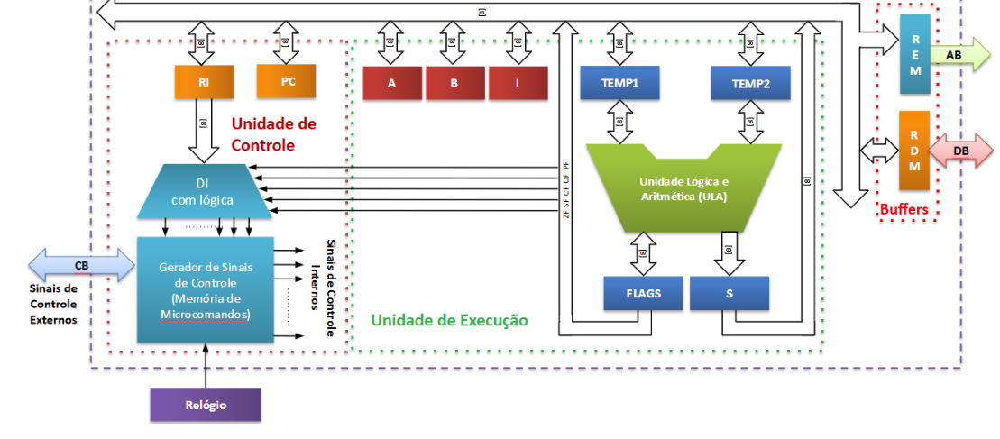
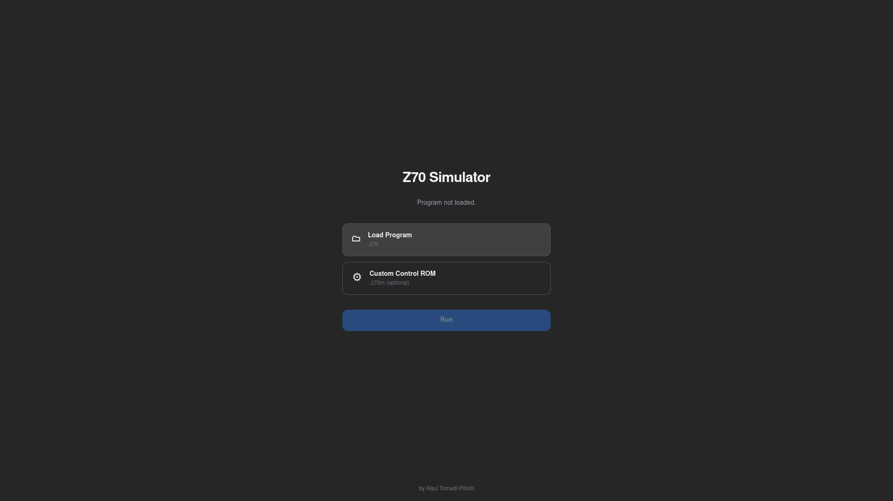
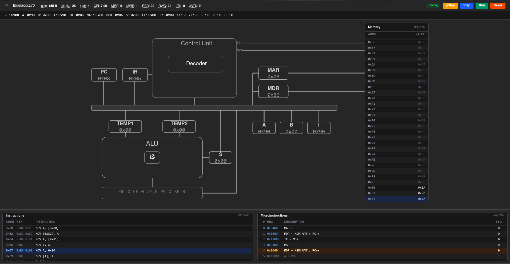
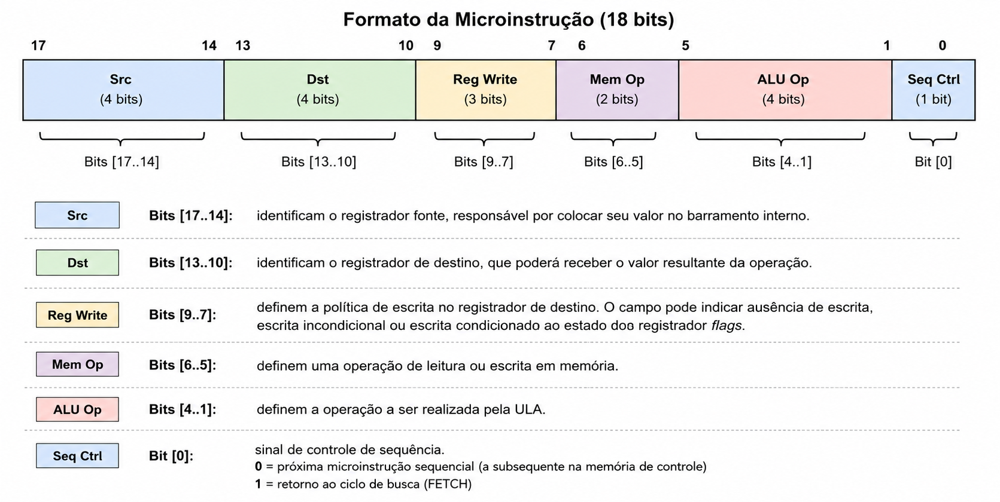
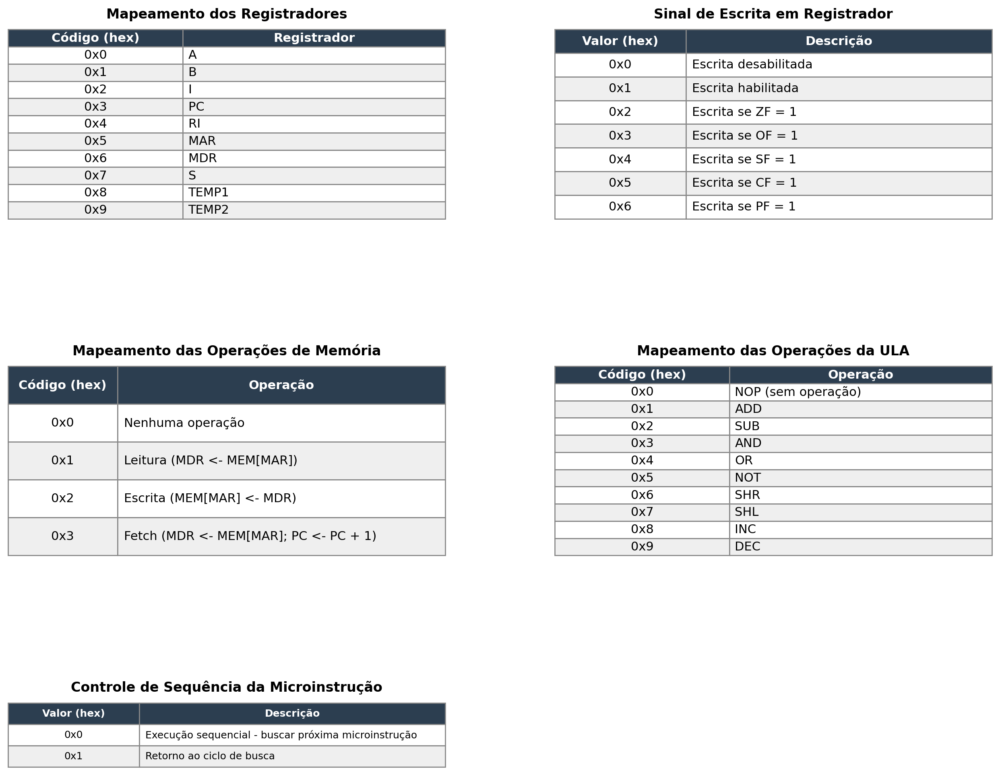

# Ferramenta Didática Para Simulação da Arquitetura Z70

Simulador da arquitetura hipotética Z70, desenvolvido para apoiar o ensino de
Fundamentos de Arquitetura de Computadores, com visualização interativa da
execução de instruções e microinstruções.

## Arquitetura Z70

A arquitetura hipotética Z70 é um modelo simplificado desenvolvido para fins
didáticos, inspirado na arquitetura x86 da Intel. Trata-se de uma arquitetura
de 8 bits, com endereçamento de até 256 bytes de memória, representação de
inteiros com sinal em complemento de dois e unidade de controle
microprogramada. Sua estrutura é composta por uma Unidade Lógica e Aritmética
(ULA), registradores, memória e um barramento unificado, conforme apresentado
na figura a seguir.

A arquitetura contempla registradores de propósito geral (A e B), registradores
auxiliares (TEMP1, TEMP2 e S), registradores de controle (*Program Counter*
(PC), *Instruction Register* (IR), *Memory Address Register* (MAR) e *Memory
Data Register* (MDR)), registrador de índice (I) e o registrador de estado
(*Flags*), composto pelos indicadores CF (*Carry Flag*), ZF (*Zero Flag*), SF
(*Sign Flag*), PF (*Parity Flag*) e OF (*Overflow Flag*).

O conjunto de instruções inclui operações aritméticas, lógicas, de
movimentação de dados e controle de fluxo. As instruções podem ser codificadas
em até dois bytes e utilizam diferentes modos de endereçamento, incluindo o
modo imediato, direto, via registrador e indireto. A tabela a seguir apresenta
as instruções disponíveis na arquitetura, seus respectivos códigos de operação
e funções.

| Tipo | Código | Mnemônico | Função |
|------|--------|-----------|--------|
| Aritmética | 0H | add | Adição |
| Aritmética | 1H | sub | Subtração |
| Aritmética | 2H | cmp | Comparação |
| Aritmética | 3H | inc | Incremento |
| Aritmética | 4H | dec | Decremento |
| Lógica | 5H | and | E lógico |
| Lógica | 6H | or | Ou lógico |
| Lógica | 7H | not | Não lógico |
| Lógica | 8H | shr | Deslocamento à direita |
| Lógica | 9H | shl | Deslocamento à esquerda |
| Desvio | A0H | jmp | Desvio incondicional |
| Desvio | A1H | jz | Desvio se zero |
| Desvio | A2H | js | Desvio se negativo |
| Desvio | A3H | jc | Desvio se carry |
| Desvio | A4H | jo | Desvio se overflow |
| Desvio | A5H | jp | Desvio se paridade |
| Movimentação | BH | mov | Movimentação |
| Controle | FFH | nop | Operação nula |



## Projeto do Simulador Z70

O simulador da arquitetura hipotética Z70 foi desenvolvido com o objetivo de
reproduzir, de forma interativa, o funcionamento do processador e possibilitar
a visualização de seu estado durante a execução de programas. A implementação
contempla a modelagem dos componentes da arquitetura, a execução das instruções
em nível de microinstruções e o processo de montagem dos programas em linguagem
*assembly*. Esses elementos são integrados a uma interface gráfica que permite
acompanhar o fluxo de dados e as alterações no estado do processador ao longo
da execução.

O simulador foi desenvolvido utilizando o framework Tauri, com o núcleo do
simulador implementado na linguagem Rust e a interface gráfica implementada
utilizando as bibliotecas React e D3.js em combinação com a linguagem
TypeScript.

### Interface Gráfica

A interface gráfica foi projetada para representar visualmente a organização
da arquitetura Z70 e permitir o acompanhamento de sua execução. Inicialmente, o
simulador disponibiliza uma tela para o carregamento de programas em linguagem
*assembly*, por meio de arquivos com extensão `.z70`. Nessa etapa, também é
possível selecionar uma memória de controle personalizada. Após o carregamento,
a interface principal apresenta os componentes do processador e da memória de
forma integrada, incluindo registradores, ULA, unidade de controle e
barramentos.

Durante a execução, as instruções e microinstruções ativas são destacadas e o
fluxo de dados entre os componentes é indicado visualmente pelo barramento,
permitindo acompanhar as operações realizadas pelo processador. A interface
também disponibiliza métricas de execução do programa, como número de ciclos,
instruções executadas, ciclos por instrução e operações de acesso à memória e
aos registradores.

As figuras a seguir apresentam, respectivamente, as telas de carregamento de
programas e de execução do simulador.





### Memória

A memória do simulador é composta por 256 posições endereçáveis, cada uma
correspondendo a 1 byte. Adota-se um modelo de memória unificada, no qual
instruções e dados compartilham o mesmo espaço de endereçamento, seguindo o
conceito da arquitetura de Von Neumann. O posicionamento de código e dados pode
ser controlado durante a montagem por meio das diretivas do assembler, enquanto
a execução é iniciada, por padrão, a partir do endereço zero.

### Memória de Controle

A memória de controle armazena as microinstruções responsáveis por definir o
comportamento interno da CPU durante a execução das instruções. Sua organização
e codificação foram projetadas visando simplicidade e caráter didático. A
memória é dividida em duas regiões: uma fixa, destinada ao ciclo de busca
(*fetch*), comum a todas as instruções, e outra variável, que armazena as
sequências de microinstruções específicas de cada instrução.

#### Codificação das Microinstruções

Para possibilitar o armazenamento dos sinais de controle na memória de
controle, cada microoperação é representada por uma palavra binária de 18 bits,
onde cada parte da palavra indica quais sinais de controle serão ativados em
determinado ciclo. A estrutura da microinstrução é ilustrada na figura a
seguir.





Os campos das microinstruções utilizam mapeamentos binários fixos para a
seleção de registradores, operações da ULA, operações de memória e controle de
sequência.

#### Carregamento da Memória de Controle

A memória de controle pode ser inicializada por uma configuração padrão,
embutida estaticamente no binário do simulador, ou por meio de um arquivo
fornecido pelo usuário. A configuração associa cada *opcode* a uma sequência
ordenada de microinstruções, enquanto uma entrada específica é reservada ao
ciclo de busca (*fetch*), executado no início de cada instrução.

O carregamento externo permite modificar as sequências de microinstruções sem
alterações no código-fonte. O arquivo é organizado em linhas que associam
identificadores, como `FETCH` ou *opcodes*, às respectivas sequências de
microinstruções em hexadecimal. Como exemplo, o ciclo de busca é definido por:

```
FETCH -> 0xD480, 0x0060, 0x19080
```

A decodificação dessa sequência é apresentada na tabela a seguir.

| Código | Src | Dst | RegWrite | Mem Op | ULA Op | Seq | Micro-operação |
|--------|-----|-----|----------|--------|--------|-----|----------------|
| 0xD480 | 0x3 | 0x5 | 0x1 | 0x0 | 0x0 | 0x0 | MAR <- PC |
| 0x0060 | 0x0 | 0x0 | 0x0 | 0x3 | 0x0 | 0x0 | MDR <- MEM[MAR]; PC <- PC + 1 |
| 0x19080 | 0x6 | 0x4 | 0x1 | 0x0 | 0x0 | 0x0 | IR <- MDR |

De forma semelhante, a instrução *ADD A, B*, associada ao *opcode* `0x00`, é
implementada pela sequência:

```
0x00 -> 0x2080, 0x6480, 0x21C82, 0x1C081
```

A tabela a seguir apresenta a decodificação correspondente.

| Código | Src | Dst | RegWrite | Mem Op | ULA Op | Seq | Micro-operação |
|--------|-----|-----|----------|--------|--------|-----|----------------|
| 0x2080 | 0x0 | 0x8 | 0x1 | 0x0 | 0x0 | 0x0 | TEMP1 <- A |
| 0x6480 | 0x1 | 0x9 | 0x1 | 0x0 | 0x0 | 0x0 | TEMP2 <- B |
| 0x21C82 | 0x8 | 0x7 | 0x1 | 0x0 | 0x1 | 0x0 | S <- TEMP1 + TEMP2 |
| 0x1C081 | 0x7 | 0x0 | 0x1 | 0x0 | 0x0 | 0x1 | A <- S |

As sequências são executadas na ordem definida até que o campo de controle de
sequência indique o término, retornando então à execução da sequência reservada
ao ciclo de busca (FETCH).

### Unidade Central de Processamento

A Unidade Central de Processamento (CPU) é responsável pela execução das
instruções e pela coordenação das operações do sistema. No simulador, é
composta pela Unidade de Controle (UC), Unidade Lógica e Aritmética (ULA) e
pelos registradores, que atuam de forma integrada durante o ciclo de execução.

A UC interpreta as instruções e gera os sinais de controle necessários para
coordenar as micro-operações. A ULA realiza operações aritméticas e lógicas,
atualizando também o registrador de estados (Flags). Os registradores armazenam
temporariamente dados e informações de controle, sendo atualizados ao longo da
execução das instruções.

### Barramento

O barramento é responsável pela comunicação e transferência de dados e sinais
entre os componentes do sistema. Internamente, o simulador utiliza um
barramento único compartilhado para endereços e dados, controlado durante as
microoperações. Na comunicação com a memória, são utilizados barramentos
distintos de endereços e dados, além de sinais de controle para operações de
leitura (*rd*) e escrita (*wr*).

### Assembler

O *assembler* traduz programas escritos em *assembly* da arquitetura Z70 para
código de máquina, conforme a codificação definida pela sua *Instruction Set
Architecture* (ISA). O processo é realizado em duas passagens: a primeira
identifica os rótulos e os associa a seus respectivos endereços de memória em
uma tabela de símbolos. A segunda traduz as instruções, resolve os rótulos,
identifica os operandos e seus modos de endereçamento e gera o código binário
final, que é posteriormente carregado na memória do simulador.

Além das instruções da arquitetura, o simulador implementa a instrução
adicional *hlt* (*halt*), com código de operação `0xFE`, utilizada para indicar
o término da execução.

O *assembler* também oferece diretivas para organização e alocação de dados e
código. As diretivas `.text` e `.data` identificam, respectivamente, as seções
de código e dados, enquanto a diretiva `db` permite inicializar valores em
nível de byte. A diretiva `org` define o endereço de memória a partir do qual
as instruções ou dados subsequentes serão posicionados, possibilitando o
controle explícito do *layout* do programa em memória.

### Núcleo de Execução

O núcleo de execução é responsável por coordenar o funcionamento da CPU,
controlando o ciclo de execução das instruções e a atualização do estado
interno do simulador. Esse ciclo é composto pelas etapas de busca (*fetch*), na
qual a instrução é obtida da memória a partir do endereço armazenado no
registrador PC, decodificação (*decode*), na qual a instrução é interpretada e
associada à sequência de microinstruções correspondente na memória de controle,
e execução (*execute*), na qual as microinstruções são processadas
sequencialmente, podendo envolver operações aritméticas e lógicas, acesso à
memória e atualização de registradores.

A cada ciclo de instrução, o registrador PC é atualizado, permitindo a
continuidade da execução do programa. Esse processo se repete continuamente
enquanto houver instruções a serem executadas.
